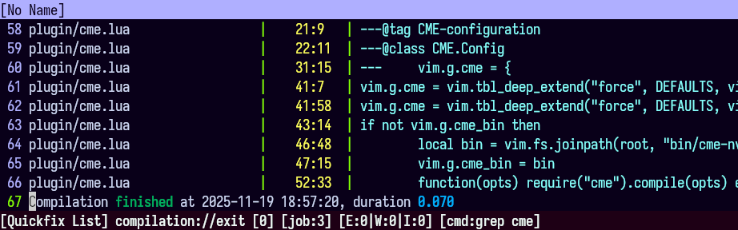

# cme.nvim

**C**ompilation **M**ode, not in **E**macs.



## Installation

Using Neovim's built-in package manager:

```lua
vim.pack.add({
    {
        src = "https://github.com/yilisharcs/cme.nvim",
    },
    {
        src = "https://github.com/akinsho/toggleterm.nvim",
    },
})
```

Using [lazy.nvim](https://github.com/folke/lazy.nvim):

```lua
{
    "yilisharcs/cme.nvim",
    specs = {
        {
            "https://github.com/nvim-lualine/lualine.nvim",
            optional = true,
            -- Fixes the small delay on `on_exit` updates
            opts = { options = { refresh = { statusline = 16 } } },
        },
    },
}
```

## Configuration

Below are the available options and their default values:

```lua
vim.g.cme = {
    -- Enable <C-c> for the quickfix window.
    interrupt = true,
    -- Preferred user shell. Accepts any executor that supports -c.
    shell = vim.o.shell,
    -- Expand '%' to the current file name.
    shell_expand = true,
}
```

## Usage

cme.nvim provides a `:Compile` command that runs tasks in the background and
loads their output into the quickfix list on the fly, along with their start
time, end time, duration, and exit codes. If called with no arguments, the
last known task is executed. If called as `:Compile!`, it won't automatically
open the quickfix window on exit.

The `:Recompile` command sets up an autocommand to re-run the provided task (or
last known) after every write. Note that it doesn't trigger if you move out of
the directory where it was called, and any new invocation clears the previous
autocommand. Calling `:Recompile` with no arguments while a watcher is active
will disable the watcher.

## See also

- compile-mode.nvim: <https://github.com/ej-shafran/compile-mode.nvim/>
- vim-dispatch: <https://github.com/tpope/vim-dispatch>

## License

Copyright (C) 2025 yilisharcs <yilisharcs@gmail.com>

Licensed under the Apache License, Version 2.0 (the "License");
you may not use this file except in compliance with the License.
You may obtain a copy of the License at

    http://www.apache.org/licenses/LICENSE-2.0

Unless required by applicable law or agreed to in writing, software
distributed under the License is distributed on an "AS IS" BASIS,
WITHOUT WARRANTIES OR CONDITIONS OF ANY KIND, either express or implied.
See the License for the specific language governing permissions and
limitations under the License.
