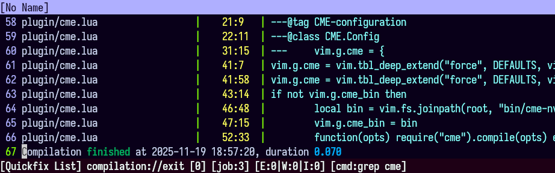

# cme.nvim

Compilation Mode, not in Emacs.



## INSTALLATION

Using Neovim's built-in package manager:

```lua
vim.pack.add({
        src = "https://github.com/yilisharcs/cme.nvim",
})
```

Using [lazy.nvim](https://github.com/folke/lazy.nvim):

```lua
{
        "yilisharcs/cme.nvim",
        init = function()
                vim.g.cme = { --[[ config goes here ]] }
        end
        specs = { {
                "https://github.com/nvim-lualine/lualine.nvim",
                optional = true,
                -- Fixes the small delay on `on_exit` updates
                opts = { options = { refresh = { statusline = 16 } } },
        } },
}
```

## INTRODUCTION

_cme.nvim_ is a minimalistic task runner inspired by Emacs' compilation-mode.
It runs jobs asynchronously, streaming their output into the `quickfix` list in
real time, and populates the statusline with metadata like their start time,
end time, duration, exit codes, and their error-warning-info counter.

### Design

I watch Tsoding. He uses Emacs. I don't use Emacs (and I don't plan to either)
but I like what Emacs has to offer. Existing plugins were either hard to wrap
my head around or not obviously extensible, so I made this. Initially, it was
meant to torture the `quickfix` list into acting like an interactive terminal so
as to replace my usage of toggleterm.nvim, which didn't work out too well thus
far (but I haven't given up, trust!). My goal is to leverage existing features
and integrate with native Nvim instead of reinventing the wheel.

What this plugin doesn't do (yet):
    - Support `sudo`
    - Interactive input
    - Process high outputs without stutter

### Commands

##### :MXCompile[!] {cmd}

                        Execute {cmd} in the background. If called with no
                        arguments, the last known command is re-run.
                        If called as `:MXCompile!`, it won't automatically
                        open the quickfix window on completion.

##### :MXRecompile[!] {cmd}

                        Setup a watcher to re-run {cmd} on every buffer save.
                        Calling with no arguments while a watcher is active
                        disables it.
                        If called as `:MXRecompile!`, it won't automatically
                        open the quickfix window on completion.

##### :MXKill

                        Immediately terminate the active background job.

### Setup

This plugin works out of the box via 'runtimepath'. It can be configured with
`vim.g.cme` before the plugin is loaded, and provides a global Lua table for
scripting. Call `CME.setup()` to refresh all internal side-effects.

See `CME-configuration` for `config` structure and default values.

### Tips

Leverage built-in `quickfix` features to improve your workflow:
    - Jump between errors with `:cprev` and `:cnext`.
    - Operate on the quickfix list with `:cdo` and `:cfdo`.
    - Cycle through previous results with `:colder` and `:cnewer`.
    - Filter results with `:Cfilter`.

## CONFIGURATION

```lua
---@type cme.Opts
vim.g.cme = {
        -- Preferred user shell.
        shell = vim.o.shell,
        -- Extra flags to pass to the shell.
        shell_flags = {},
        -- Expand wildcard characters.
        shell_expand = true,
        -- Enable SIGTERM <C-c> for the quickfix window.
        interrupt = true,
        -- Enable the custom |quickfixtextfunc| and |syntax|.
        -- 
        -- WARNING: The conceal extmarks used for filename truncation can cause
        --          the cursor to behave erratically, jumping left and right as
        --          the length of the concealed region changes.
        qf_format = true,
        -- Width for filename padding and conceal truncation.
        qf_pad = 34,
        -- Map errorformat to a list of commands.
        efm_rules = {
                ["%f:%l:%c:%m,%f:%l:%m"] = { "grep", "rg" },
                ["%f::0,%l"] = { "find", "fd" },
        },
        -- Command mutation rules.
        -- Hooks used to normalize shell tool output for the |quickfix| list.
        -- Strings or function return values are injected after the executable and before other flags; functions return `nil` to skip. This occurs after expansion but before shell invocation.
        modifiers = {
                -- Appends flags to ensure output matches the efm above
                find = "-printf '%p::0\\n'",
                -- Conditional: only appends flags if user omitted them
                -- Whitespace prefix on the return value is handled here
                fd = function(cmd)
                        if not cmd:match("--format") then
                                return cmd .. ' --format="{}::0"'
                        else
                                return cmd
                        end
                end,
        },
        -- Command-specific syntax injection.
        -- Maps command prefixes to |filetype| names for the quickfix buffer.
        syntax = {},
}
```

## TROUBLESHOOTING

If you encounter issues, please follow these steps:

Run `:checkhealth cme` to verify your environment and Nvim version.

Use the provided minimal reproduction script to isolate the issue from your
personal configuration:

```bash
just repro
```

Alternatively, run it directly with Neovim:

```bash
nvim --clean -u scripts/repro.lua
```

If the issue persists in the minimal environment, please report it at:

https://github.com/yilisharcs/cme.nvim/issues

## SIMILAR PLUGINS

    - [tpope-vim-dispatch](https://github.com/tpope/vim-dispatch)
    - [ej-shafran/compile-mode.nvim](https://github.com/ej-shafran/compile-mode.nvim)

## LICENSE

Copyright 2025-2026 yilisharcs

Licensed under the Apache License, Version 2.0 (the "License");
you may not use this file except in compliance with the License.
You may obtain a copy of the License at

http://www.apache.org/licenses/LICENSE-2.0

Unless required by applicable law or agreed to in writing, software
distributed under the License is distributed on an "AS IS" BASIS,
WITHOUT WARRANTIES OR CONDITIONS OF ANY KIND, either express or implied.
See the License for the specific language governing permissions and
limitations under the License.